# DeXMart System Diagrams

> All diagrams use [Mermaid](https://mermaid.js.org/) syntax and render natively on GitHub, GitLab, and most Markdown viewers.
>
> **Last verified**: 2026-04-03 | **Branch**: `fusion/phase-4-backend-dissolution`

---

## Table of Contents

1. [C4 Context Diagram](#1-c4-context-diagram)
2. [C4 Container Diagram](#2-c4-container-diagram)
3. [Component Diagram -- DeXMart src/](#3-component-diagram--dexmart-src)
4. [Request Authorization Flow](#4-request-authorization-flow)
5. [Message Processing Pipeline](#5-message-processing-pipeline)
6. [Channel Lifecycle Sequence](#6-channel-lifecycle-sequence)
7. [Billing Gate Flow](#7-billing-gate-flow)
8. [Config Resolution Flow](#8-config-resolution-flow)
9. [Session Persistence Flow](#9-session-persistence-flow)
10. [Frontend Data Flow](#10-frontend-data-flow)
11. [Backend Startup Sequence](#11-backend-startup-sequence)
12. [Deployment Topology](#12-deployment-topology)
13. [Monorepo Package Dependencies](#13-monorepo-package-dependencies)
14. [Firestore Data Hierarchy](#14-firestore-data-hierarchy)
15. [Fusion Phase Roadmap](#15-fusion-phase-roadmap)

---

## 1. C4 Context Diagram

The highest-level view: DeXMart and its external actors.

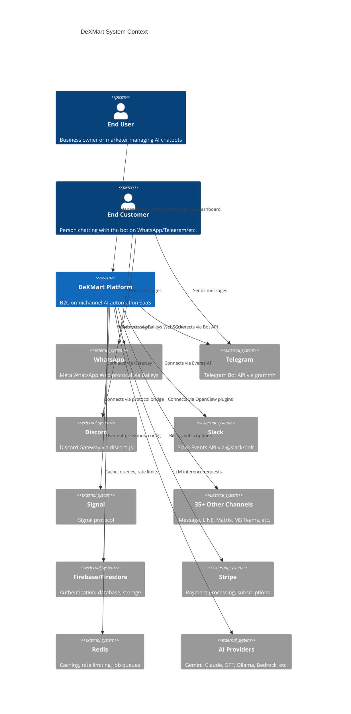

---

## 2. C4 Container Diagram

The major runtime containers within DeXMart.

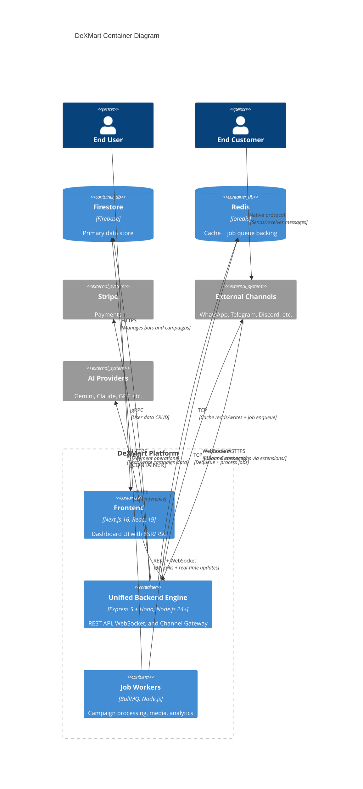

---

## 3. Component Diagram -- DeXMart src/

How the modules inside `src/` relate to each other. There is no "OpenClaw layer" vs "DeXMart layer" -- it is one project.

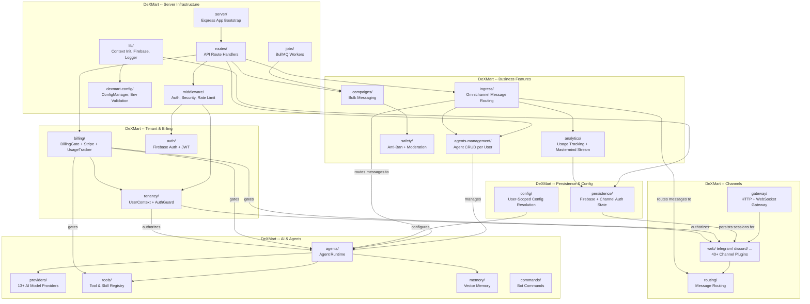

---

## 4. Request Authorization Flow

How every request is authorized before reaching DeXMart capabilities.

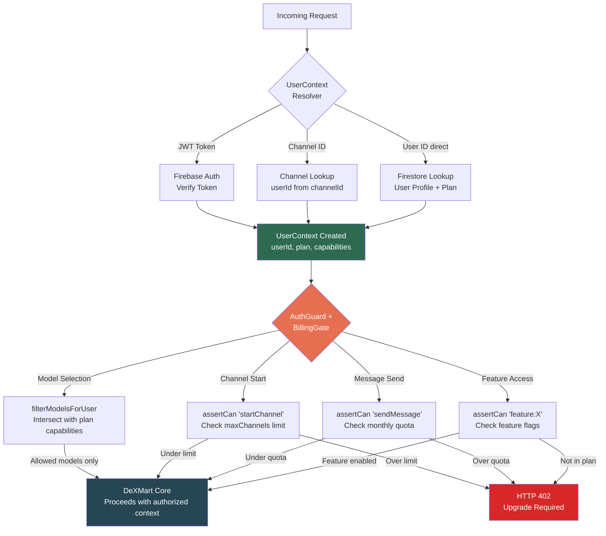

---

## 5. Message Processing Pipeline

End-to-end flow of an inbound message from any channel.

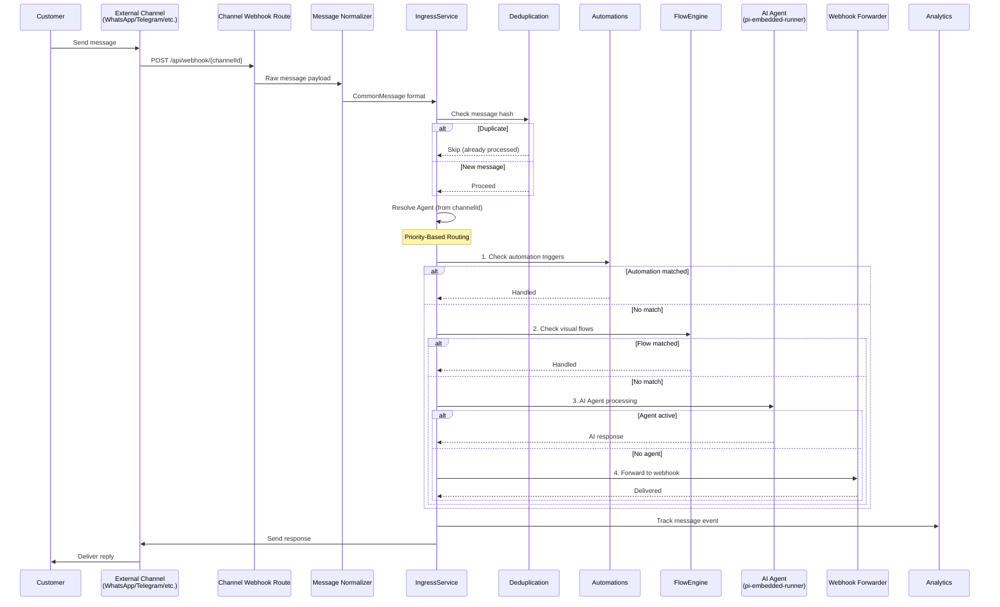

---

## 6. Native Extension Plugin Lifecycle

How a user connects a new channel (e.g., WhatsApp) through the grounded engine (Phase 5).

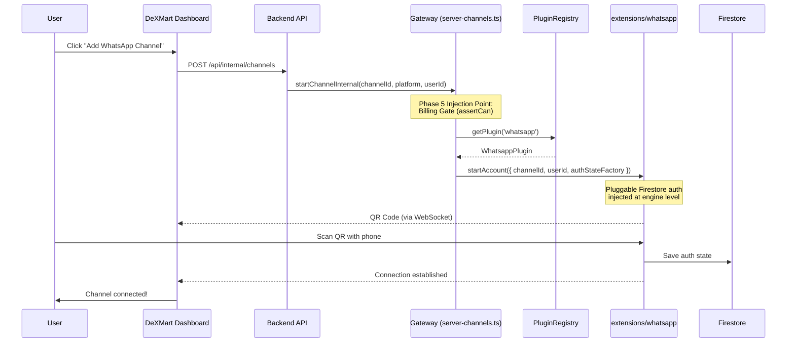

---

## 7. Billing Gate Flow

How the billing system gates operations.

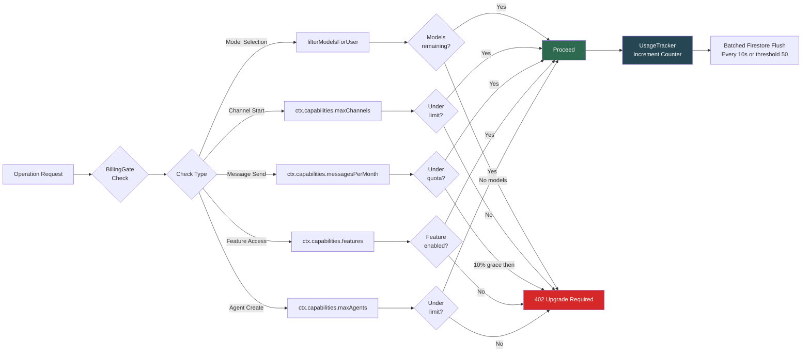

---

## 8. Config Resolution Flow

How user-scoped configuration is resolved with three-layer caching.

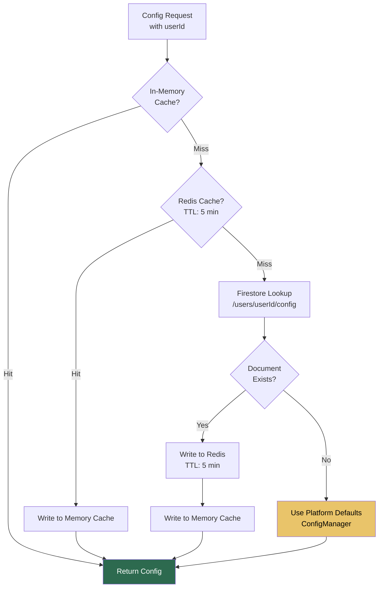

---

## 9. Session Persistence Flow

How channel auth state is persisted universally to Firestore (replacing file-based).

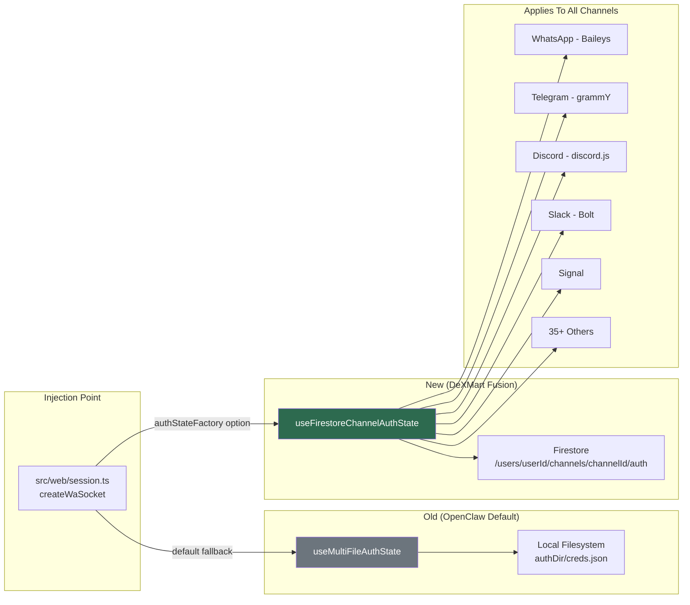

---

## 10. Frontend Data Flow

How data moves through the Next.js 16 frontend.

```mermaid
flowchart TD
    subgraph "Next.js 16 App Router"
        PAGE[Page Route<br/>app/(dashboard)/agents/page.tsx]
        PAGE --> RSC{Server<br/>Component?}

        RSC -->|Yes| DAL[Data Access Layer<br/>server/dal/]
        DAL --> FSQ[Firestore Query<br/>Direct server-side]
        FSQ --> HTML[Pre-rendered HTML<br/>Streamed to client]

        RSC -->|No - Client| CC[Client Component<br/>'use client']
        CC --> RQ[React Query<br/>useQuery / useMutation]
        RQ --> API[REST API<br/>fetch /api/*]
        API --> BE[Backend Express<br/>Port 3001]

        CC --> WS[WebSocket<br/>Socket.io Client]
        WS --> RT[Real-time Events<br/>Mastermind Stream,<br/>Channel Status,<br/>QR Codes]
    end

    subgraph "Client State"
        ZU[Zustand Stores]
        ZU --> BS[useBillingStore<br/>Plan, usage]
        ZU --> US[useUIStore<br/>Sidebar, theme]
        ZU --> OS[useOmnichannelStore<br/>Active channels]
        ZU --> MS[useMastermindStore<br/>Agent reasoning]
    end

    CC --> ZU

    style DAL fill:#264653,color:#fff
    style RQ fill:#2a9d8f,color:#fff
    style ZU fill:#e76f51,color:#fff
```

---

## 11. Backend Startup Sequence

The order of initialization when the backend starts.

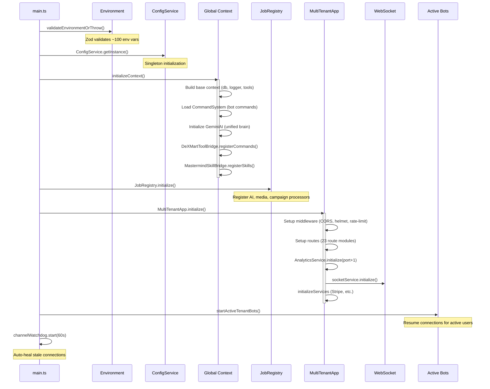

---

## 12. Deployment Topology

Runtime infrastructure layout.

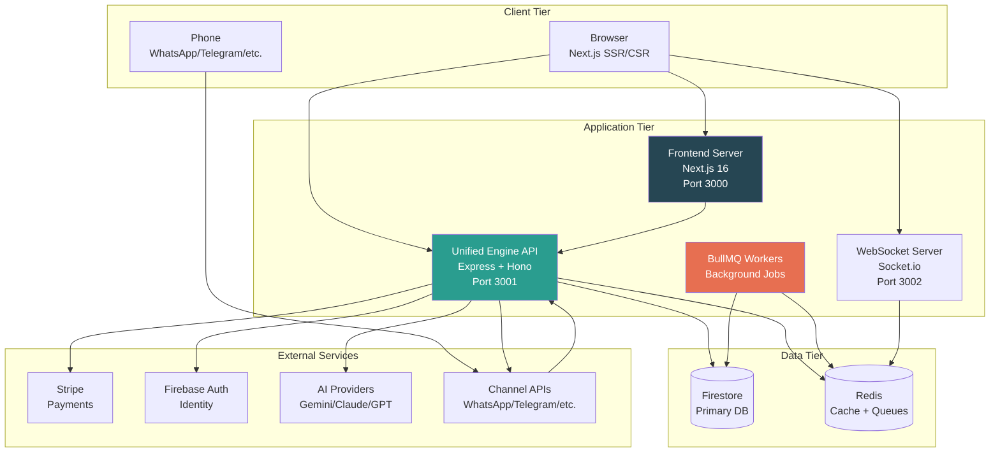

---

## 13. Monorepo Package Dependencies

How the pnpm workspace packages relate post-fusion.

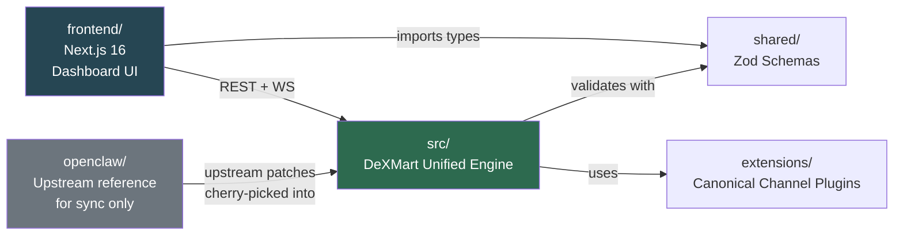

---

## 14. Firestore Data Hierarchy

The document/subcollection structure in Firestore.

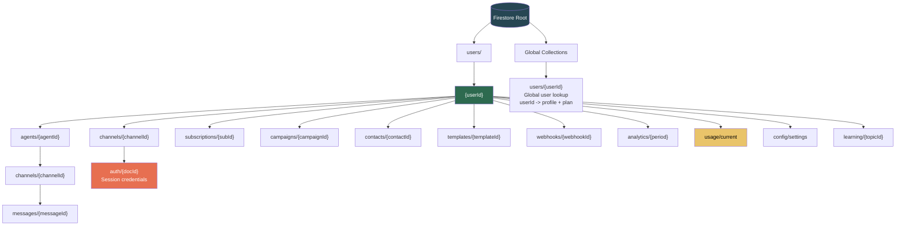

> **Note**: The B2C model uses `users/{userId}` as the top-level scope (equivalent to `tenants/{tenantId}` in B2B). The codebase is transitioning terminology from "tenant" to "user" throughout.

---

## 15. Fusion Phase Roadmap

Timeline and status of the True Fusion phases.

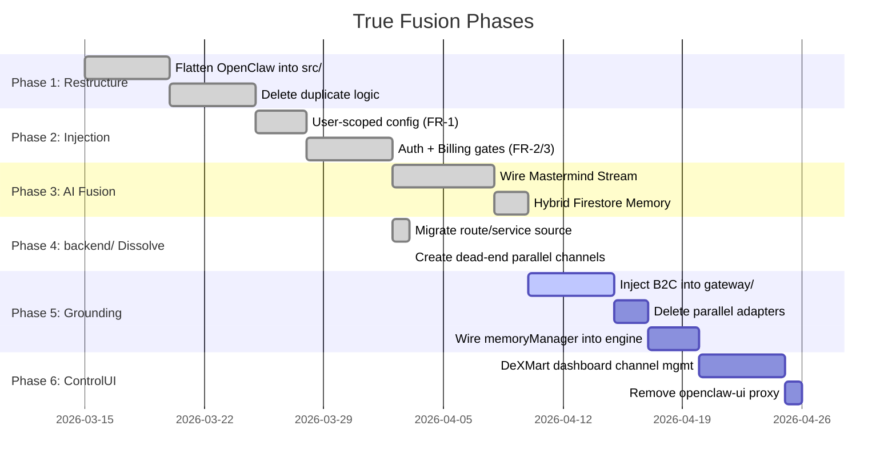

---

## Diagram Conventions

| Symbol | Meaning |
|--------|---------|
| Green fill (`#2d6a4f`) | DeXMart core component |
| Dark blue fill (`#264653`) | DeXMart frontend / infrastructure |
| Orange fill (`#e76f51`) | Critical/security component |
| Yellow fill (`#e9c46a`) | Transitional/legacy (being dissolved) |
| Gray fill (`#6c757d`) | Upstream reference only (not runtime) |
